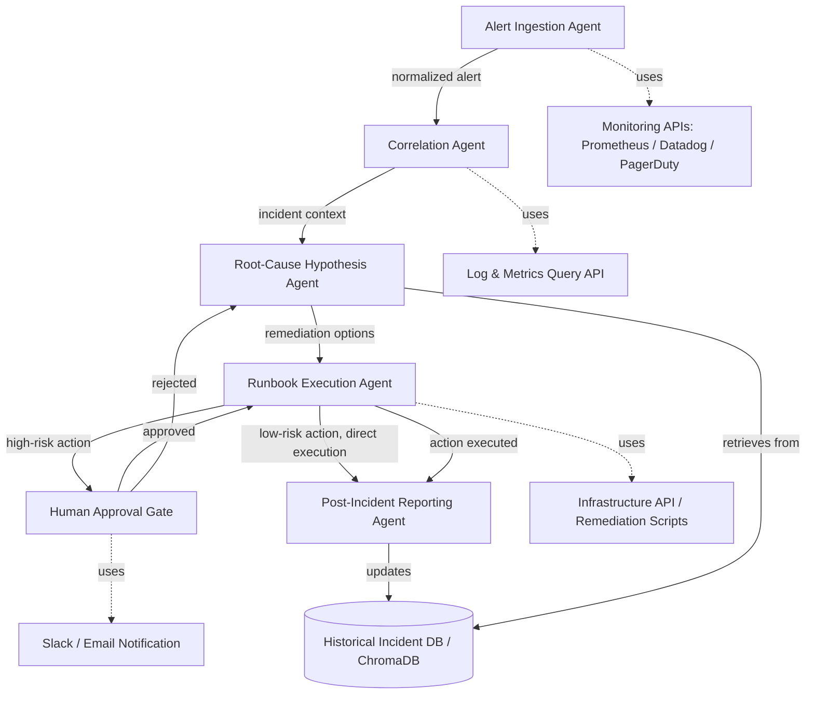
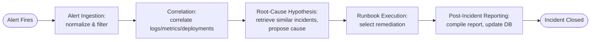
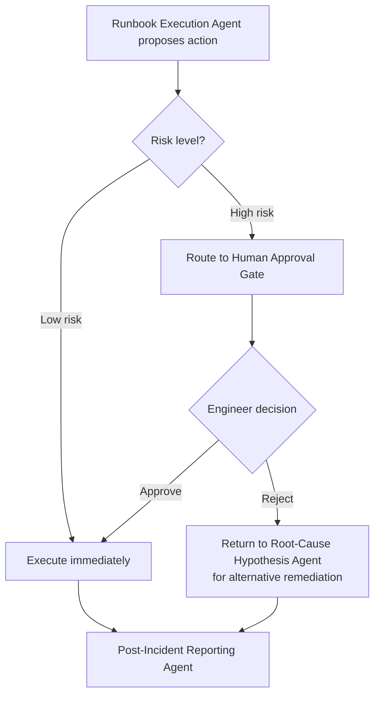
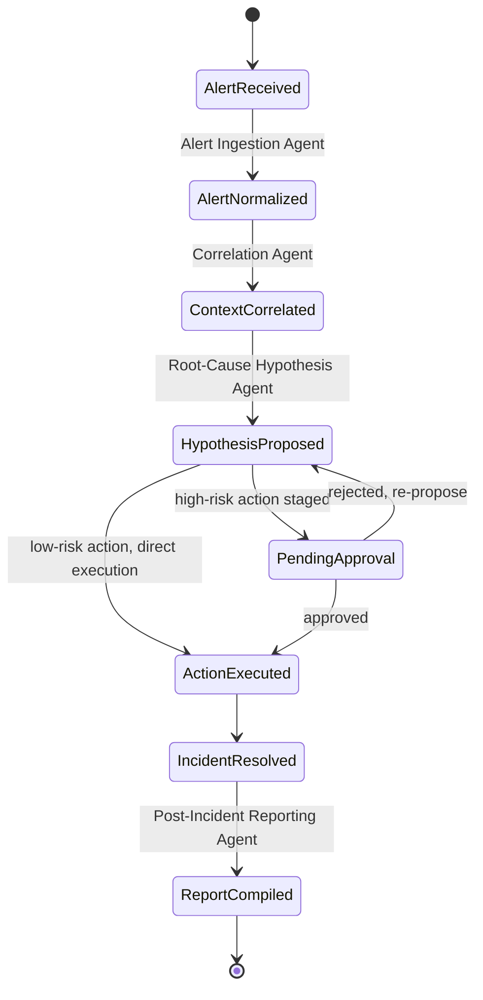

## Architecture Diagram

Shows all six agents and their connections, plus the external tools/APIs each one uses.

---

## Agent Workflow Diagram

Shows the sequential pipeline as a linear process flow.

---

## Flow Diagram (Decision Branch at Human Approval Gate)

Shows the branching logic specifically at the risk-classification decision point.

---

## State Diagram (Incident Lifecycle)

Shows the incident's states across its lifecycle, matching Section 12's state description.

